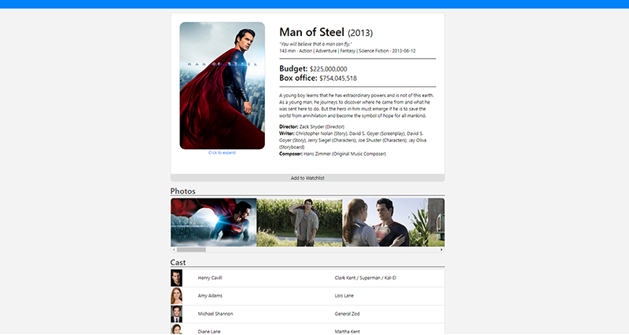

# DCDB - DC films database App
A film database app for information related to DC films (cast, crew, summaries, etc) created with Java and React.



## Table of Contents
- [Introduction](#introduction)
- [Technologies](#technologies)
- [Setup](#setup)
- [Usage](#usage)
- [Status](#status)

## Introduction
The purpose of this project is for me to familiarize myself with the different techniques in Java and React. 
The general purpose of the application itself is for the user to be able to find information about DC films. 
With additional features to have user accounts, so users will be able to keep track of the films that they have seen with their own watchlist.

### Features
- Information about films (cast, images, videos, details, etc)
- User accounts (login/logout)
- User watchlist


## Technologies
Project is created with:
- Java 8
- React 17
- Spring Boot 2.4.1
- TMDB API

## Setup
Clone this repo and run `npm install` to install all the dependencies.

## Usage
Clone this repo to your desktop and run npm install to install all the dependencies.

Once the dependencies are installed, you can run  `npm start` to start the application. You will then be able to access it at localhost:3000

```
$npm install
$npm start
```

## Status
Current in development
